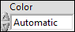
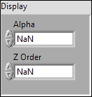
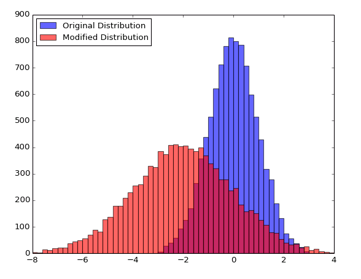
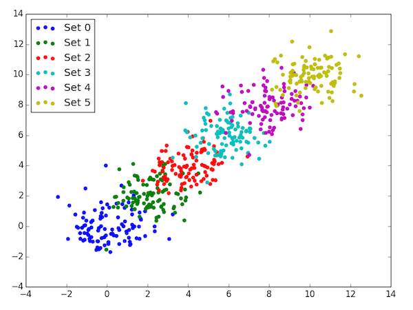
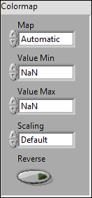
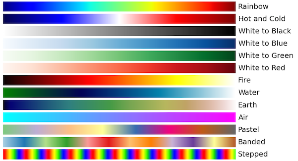

.. include:: /defs.txt

.. _guide_color:

Using Color
===========

The PlotColor Control
---------------------

To make dealing with colors easier, the Toolkit provides a special color
typedef, referred to as a **PlotColor**:

PlotColors controls show up in property clusters, and are used to control the
colors of things like lines and markers in 1D plots, the color of grid lines,
etc.

They are fully compatible with the normal LabVIEW color system.  The
data type is the same (unsigned 32-bit int); you can wire any LabVIEW color
to a terminal expecting a PlotColor and it will work just fine.  Likewise,
any named color in the PlotColor control can be wired to a LabVIEW color
terminal it it will show up correctly.

There's one difference: the first entry in the PlotColor ring is a special
value called "Automatic".  This means "use an appropriate color depending
on context".  Among other things, it makes possible the use of the Toolkit's
:ref:`automatic color cycle <guide_color_cycle>`.

.. _guide_color_alpha:

Alpha Transparency and Z-Order
------------------------------

LabVIEW supports "1-bit" transparency; in other words, there's a special color
called "transparent" which you can select from a color box.  This works
perfectly well with the Toolkit; objects with a color of "transparent" are
not displayed.

But the Toolkit goes one step further: most objects you plot can have a
*variable* level of transparency, determined by an *alpha value* between
0.0 (fully transparent) and 1.0 (fully opaque).  Overlapping objects are
then *alpha blended* together to form the final plot.

You can also control which objects appear "on top of" other objects, by
adjusting their *z-order*.  By default, the Toolkit will assign objects in 
a z-order it thinks is appropriate.

Plotting VIs which support these features will have a Display member in
their property clusters:

|double_in| **Alpha**
    Alpha blending value for the object (0.0 to 1.0).  Default is 1.0
    (fully opaque).
    
|double_in| **Z Order**
    Stacking order.  Default is chosen based on the object type.

.. _guide_color_cycle:

The Automatic Color Cycle
-------------------------

Particularly when doing 1D plots, such as those generated by :ref:`vi_line`,
:ref:`vi_scatter`, or :ref:`vi_bar`, it's common to display multiple data
sets on the same graph.  This is accomplished by simply calling multiple VIs
(or the same VI multiple times) with the same Plot ID.

But how do we illustrate that the data sets are different?  We could manually
specify different colors, but that sounds like a lot of work and error-prone...

The Toolkit addresses this issue by using an *automatic color cycle.*  When
you call one of the 1D plotting VIs without explicitly specifying a color,
a color is chosen for you.  When the next plot is made, another distinct
color is chosen, and so on.

So, for example, calling :ref:`vi_scatter` six times with six different data
sets would produce this:

There's one VI in particular that doesn't participate in the color cycle:
:ref:`vi_errorbar`.  Since that VI is used to add error bars to an existing
plot, if you don't explicitly give a color, it will pick the last color used.

Finally, each plot has its own separate color cycle, so you don't need to
worry about race conditions or plots interfering with each other.

The VIs that participate in the color cycle are:

* :ref:`vi_line`
* :ref:`vi_scatter`
* :ref:`vi_bar`
* :ref:`vi_histogram`

The color cycle goes in the following order.  Once the last element is
reached, it starts over:

* Blue
* Green
* Red
* Cyan
* Magenta
* Yellow
* Dark Gray
* Pink

.. _guide_colormaps:

Colormaps
---------

One common way to visualize 2D data is to assign colors on the basis of the
values.  For example, :ref:`vi_arrayview` and :ref:`vi_contourfilled` both
use color to illustrate the range of values in a dataset.

A "colormap" determines which color is displayed for each data value in a
dataset.  For example, consider a 2D dataset in which the values range from
-100 to +50.  If the ``White to Green`` colormap is selected, all locations
with value -100 would be colored white, all locations with +50 would be colored
green, and the values in between would be various shades between white and
green.

Once you've made a plot that uses a colormap, call :ref:`vi_colorbar` to
add a color bar.

Here's the strict-typedef control which specifies the colormap settings for
Toolkit VIs.  This usually appears as a member of the property cluster for
each VI:

|enum_in| **Map**
    The name of the colormap.  All the Toolkit colormaps are listed below.
    
|double_in| **Value Min**
    Lower range for colormapped data; values smaller than this will all be
    plotted with the first color in the colormap.
    
|double_in| **Value Max**
    Upper range for colormapped data; values larger than this will all be
    plotted with the last color in the colormap.
    
|enum_in| **Scaling**
    Choose between linear mapping (default) and logarithmic mapping.
    
|bool_in| **Reverse**
    Flip the colormap; for example, if a map has 0.0 as black and 1.0 as
    white, this will assign 0.0 as white and 1.0 as black.
    

Built-In Colormaps
------------------

.. only:: html

    Examples
    --------

    See :ref:`guide_examples` for a complete list of examples.

    * :download:`Alpha Transparency and Z-Order.vi </examples/Alpha Transparency and Z-Order.vi>`
    * :download:`Colormaps and Colorbars.vi </examples/Colormaps and Colorbars.vi>`
    * :download:`Color Cycle.vi </examples/Color Cycle.vi>`

