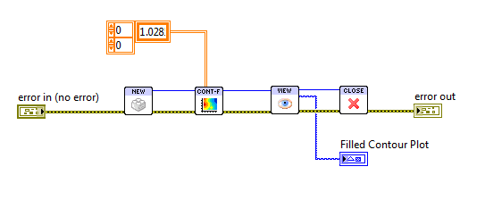
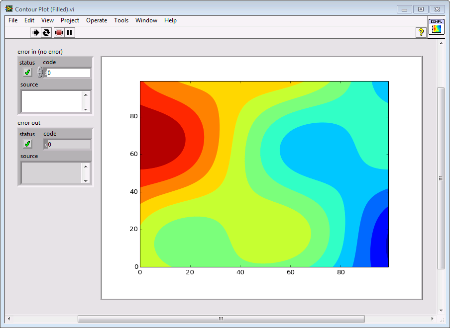
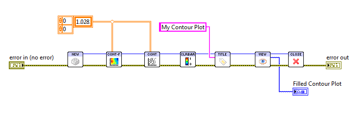
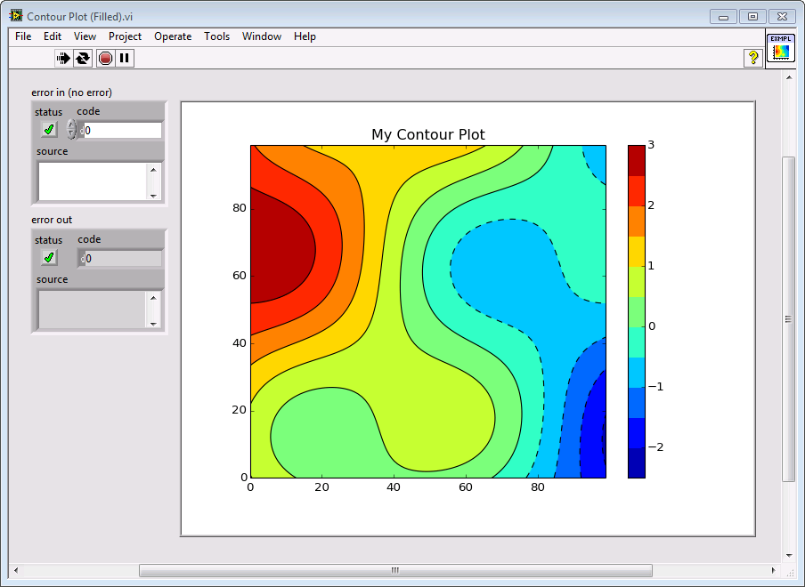
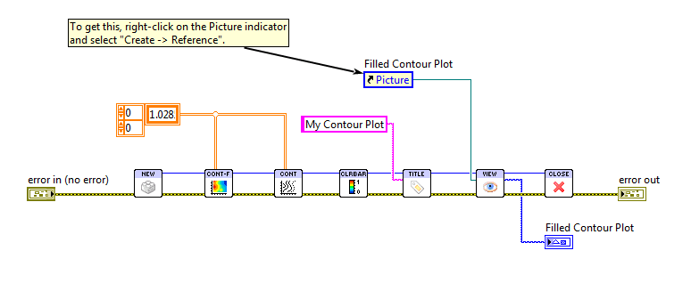
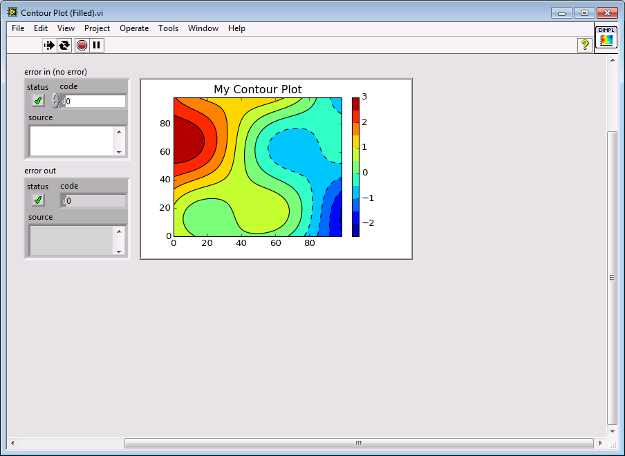
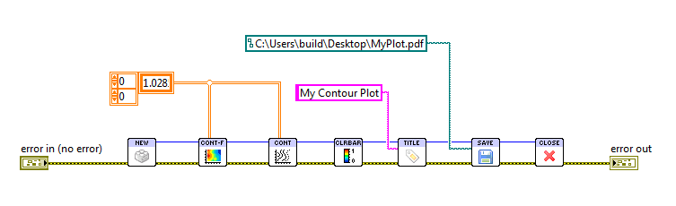
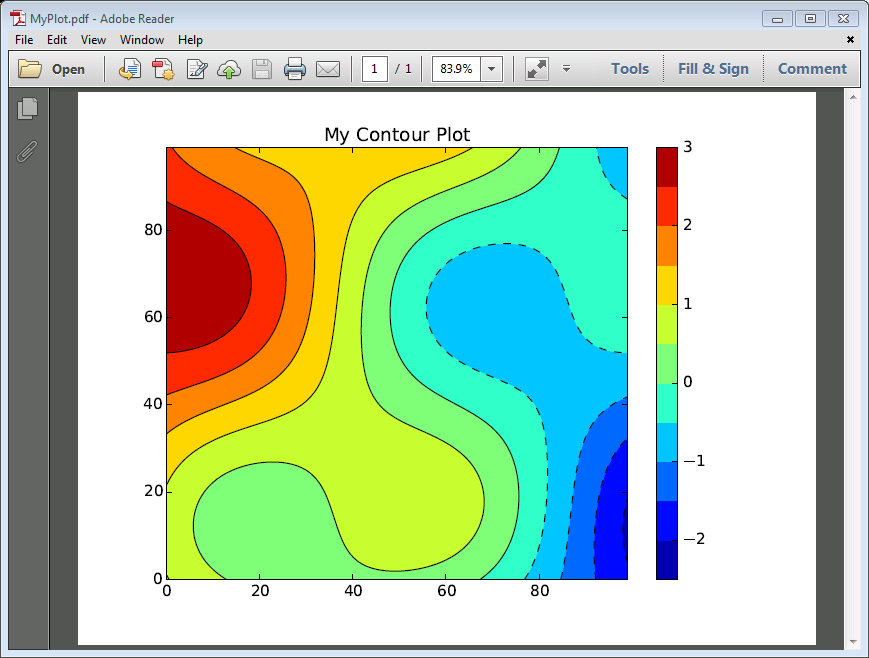
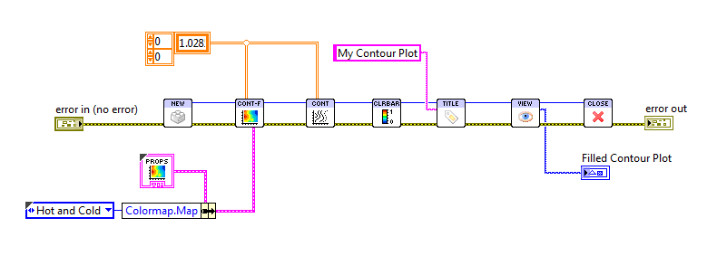
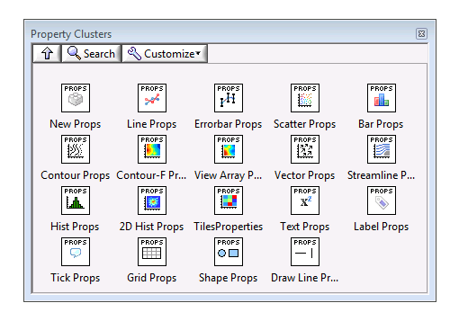

.. _guide_start:

Getting Started
===============

System Requirements
-------------------

* Windows Vista, 7, 8, or 8.1 (32 or 64-bit)
* LabVIEW 2011 SP1 or later (32 or 64-bit)
* VI Package Manager 2014 or later

Download and Install
--------------------

Downloads for the Toolkit are available at our website:
http://www.advancedplotting.com.

The Toolkit is distributed as a standard "VIP" package, installable via the
VI Package Manager (VIPM) 2014 or later.  VIPM 2014 ships with LabVIEW 2014.
If you're using LabVIEW 2013 or earlier, it's a free download from
`JKI's web site <http://jki.net/vipm>`_.

.. note::
    VIPM 2014 or later is required.  Trying to install the Toolkit with
    VIPM 2013 or earlier will result in an error message.
    
Simply double-click the package to start installation.  Once complete, the
Toolkit will show up under the "Addons" palette on the LabVIEW block diagram.

Examples
--------

.. only:: html

    By far the best way to learn a new toolkit in LabVIEW is to start with
    examples.  In the :ref:`guide_examples` section, there's an example VI
    for nearly every Toolkit VI.  You can also download a ZIP file with all
    the examples.
    
.. only:: latex

    By far the best way to learn a new toolkit in LabVIEW is to start with
    examples.  On our website at `http://www.advancedplotting.com`_, you
    can find an example VI for nearly every Toolkit VI.  You can also
    download a ZIP file with all the examples.
    
Getting Help
------------

You can also get context help easily on the LabVIEW block diagram.  Simply turn
on the "Show Context Help" setting in LabVIEW's Help menu, and hover your
cursor over any Toolkit VI.

Complete reference documentation also ships with the Toolkit.  You can
see a complete set of reference documentation here: :ref:`ref_index`.
Or from the block diagram, just right-click any VI and select "Help":

.. image:: MenuHelp.png

Direct contact information can also be found on our website, at
http://www.advancedplotting.com.
 
Making Plots
------------

The central object in the Toolkit universe is the *plot*.  A plot isn't
limited to a single kind of data, like a bar or scatter graph.  Rather, it's
a canvas on which you can combine all kinds of objects: contours, tiles, 
lines, bars, points, text, mathematical symbols, legends, colorbars...

Like many kinds of data in LabVIEW, plots are resources that you have to open and
close.  First, use :ref:`vi_new` to create a new **Plot Identifier**, or Plot ID.
Then supply that Plot ID to the various Toolkit VIs, along with your data.
Each one will add content to your plot.  When finished, remember to close the
plot with :ref:`vi_close`.  Here's a simple example which creates a new plot
and draws a series of filled contours:

The result:

You'll notice there are error terminals for :ref:`vi_close`.  This VI follows
the behavior used in other LabVIEW cleanup VIs... although it propagates errors
from input to output, the plot will still be closed if there's an error on the
"error in" terminal.  Also, if you supply an invalid or already-closed Plot ID
to :ref:`vi_close`, it will simply be ignored.

The Plot ID is an opaque identifier for a reason.  Plots aren't handled as
LabVIEW controls or bitmapped graphics.  Rather, they are stored as objects
in memory using *vector graphics*.  Among other things, that means they can
be reshaped and resized at any time with no loss of quality.

Combining Multiple Features
---------------------------

Remember, a plot is a canvas to which you can add anything you want.  To add 
multiple features to a plot, just call multiple Toolkit VIs, and their
output will be combined to make the final result.

For example, let's add contour lines to our original plot, along with a
colorbar, and set a title:

The result:

Viewing Plots
-------------

Since there's no LabVIEW control, how do you view a plot?  There are a couple
of ways, but the easiest is to render it to a LabVIEW picture.  This is the
approach used in the example above.  Simply use the :ref:`vi_view` Toolkit VI,
and create a Picture indicator on the front panel.  That's the control used
in the above examples.

Plots have a default size of 640 pixels wide by 480 pixels tall.  That might
not exactly match your Picture indicator, though.  So the Toolkit provides an
optional **Ref for Sizing** input to :ref:`vi_view`.  Just create a reference
to your Picture and supply it to the VI.  The plot will be rendered at
exactly the required size to fit the control.  

Let's add that reference to the block diagram, and then scrunch the Picture
indicator down and see what happens:

The result:

Resizing Plots
--------------

Keep in mind that this kind of resizing is **non-destructive**, since the
Toolkit uses vector graphics internally.  Your plot won't become blurry or
corrupted. 

You don't need a Picture control around to set the size of a plot.  Instead,
simply use :ref:`vi_size` and specify the size you want in pixels.  This is
especially handy when saving to disk.  Speaking of which...

Saving Plots
------------

The great thing about the Toolkit is that you can create **production quality output**
directly from the block diagram.  Use :ref:`vi_save` to save your plots
in any of half a dozen formats.  

The output format is determined by the file extension.  Here, we modify our
example by replacing :ref:`vi_view` with :ref:`vi_save`:

Let's open that in Adobe Reader to see how it came out:

Using Property Clusters
-----------------------

The Toolkit VIs have lots of options, but using lots of terminals in LabVIEW
can be a pain.  To address this, all the Toolkit VIs use the "standard"
terminal pattern, with one terminal reserved for the **property cluster**.
This is a cluster with options specific to the plotting VI.

For example, let's modify the example above to use the **Hot and Cold**
colormap as opposed to the default **Rainbow** colormap:

Property clusters are just data, and you can handle them the way you would any
other cluster in LabVIEW.  For simplicity and readability, we recommend
the approach shown above, using a cluster constant with the default values
combined with *Bundle By Name*.  This makes it clear what option you're
setting.

You can get a cluster constant by right-clicking the Properties terminal of the
VI, but an even easier way is through the Properties subpalette.  This
guarantees that your constant will have the right default values:

Other Useful Hints
-------------------

Plot sizes are always given in pixels, because that's what you need to
interact with Picture controls and when saving to disk.  But fonts, line widths,
marker sizes, and other elements are specified in typographical *points*
(1/72 inch).  To go back and forth, in addition to a height and width each
plot has a *DPI* or *dots per inch* setting.  This controls, for example, how
many pixels tall a text label is in 12-point font.  You can adjust the plot's
DPI using the :ref:`vi_size` Toolkit VI.

The Toolkit uses a special control for colors as well, although the values
are nearly 100% compatible with the built-in LabVIEW color boxes.  Read more
about it in :ref:`guide_color`.

You can use a wide variety of mathematical symbols in your plots.  They can
appear in axis labels, text manually added, tick marks; generally wherever
text can appear.  :ref:`guide_latex` has a complete guide.

And, for all plots dealing with "1D" data, you can plot on polar axes!  See
:ref:`guide_polar` for details.

Where To Go Next
----------------

You can find a complete list of the Toolkit VIs here: :ref:`ref_index`.
It's organized by functionality, into:

*   **Core** VIs, meaning :ref:`vi_new`, :ref:`vi_close`, etc. 

*   **1D Plotting** VIs, meaning line, scatter, bar plots; anything that takes a 
    1D array as input
    
*   **2D Plotting** VIs, meaning contour, vector arrow, streamline, 2D histogram,
    tile plots... anything that takes a 2D array or arrays as input

*   **Annotation** VIs, meaning VIs that add text, a colorbar, a legend, etc.

*   **Plot Config** VIs, meaning those that adjust a plot's size, etc.

