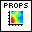
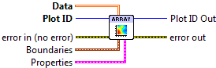

.. include:: /defs.txt

.. _vi_arrayview:

View Array
==========

Display a 2D array using pseudocolor.

This VI provides a simple way to visualize a 2D array, by coloring the
values according to a colormap.  Interpolation is used to render
the array in a smoothed fashion.

.. include:: /stdid.txt
    
|double_2d_in| **Data**
    2D array to visualize.
    
|cluster_in| **Boundaries**
    Array edge locations, in data units.
    
    |double_in| **X Min**
        Left side of array.  Default is 0.
        
    |double_in| **X Max**
        Right side of array.  Default is NX-1, or 1.0 if NX==1.
        
    |double_in| **Y Min**
        Bottom of array.  Default is 0.
        
    |double_in| **Y Max**
        Top of array.  Default is NY-1, or 1.0 if NY==1.
    
|arrayview_props| **Properties**
    Property cluster, available under the "Properties" subpalette.
        
    |cluster_in| **Colormap**
        Controls the colormap used to shade the array data.
        
        .. include:: /stdcmap.txt
        
    |cluster_in| **Display**
        Controls general appearance of the plot.
        
        .. include:: /stddisplay.txt
        
.. include:: /stderr.txt

.. only:: html

    Example
    -------

    Download :download:`ArrayView.vi </examples/ArrayView.vi>`,
    or see :ref:`guide_examples` for a complete list of examples.
    
    .. image:: ArrayViewExample.png
    
Axis Types
----------

This VI supports rectangular axes.  Use with :ref:`polar axes <guide_polar>`
will result in :ref:`error_polar`.  Likewise, only linear scales are supported.
Use with log or symlog axes will result in :ref:`error_scale`.

Errors
------

* :ref:`error_scale`
* :ref:`error_polar`
* :ref:`error_invalid`
* :ref:`error_plotting`
* :ref:`error_init`

Other information
-----------------

If an empty **Data** array is provided this VI does nothing.

A non-finite entry in **Boundaries** will be ignored, and the default used.
If any of the max/min entries in **Boundaries** are reversed, the array
will be displayed flipped along that axis.

A non-finite value in **Z Data** will appear as a "hole" or artifact in the plot.
