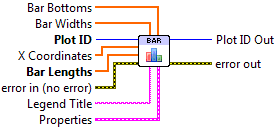

.. include:: /defs.txt
.. |bar_props| image:: barProps.png

.. _vi_bar:

Bar Plot
========

Make a bar plot.

A bar plot consists of a series of vertically-oriented rectangles.  The only
required input is **Bar Lengths**, which is an array giving the heights of the
bars.  You can optionally specify the **X Coordinates** for the centers of the
bars; if not given, they default to integers starting with 0 (0, 1, 2...).

By default, the bars start at y=0.  Provide the **Bar Bottoms**
array to specify starting Y locations for the bars instead.

All bars have the same color,  taken from the color cycle
(:ref:`guide_color_cycle`) by default.  You can override this by providing an
explicit color property via **Properties**.  Plots with a mixture of
different bar colors may be made by calling Bar.vi several times, one for each
bar color.

.. include:: /stdid.txt
    
|double_1d_in| **X Coordinates**
    Locations of the bars on the X axis (in data units).
    
|double_1d_in| **Bar Lengths**
    Size of the bars (in data units).
    
|double_1d_in| **Bar Widths**
    By default, an appropriate width is chosen for the bars automatically.
    Use this input to manually specify the width of each individual bar
    in data units.
    
|double_1d_in| **Bar Bottoms**
    By default, the bars are drawn starting at 0 on the Y axis.  Use this
    input to specify a different location for the bottom of each bar, in
    data units.
    
|string_in| **Legend Title**
    Title to be displayed if a legend is added to the plot.

|bar_props| **Properties**
    Property cluster, available under the "Properties" subpalette.
        
    |uint32_in| **Bar Color**
        Color of the bars (PlotColor or LabVIEW color).  By default, an
        appropriate color is chosen according to the
        :ref:`color cycle <guide_color_cycle>`.
        
    |cluster_in| **Line**
        Controls the appearance of the bar outlines.
        
        .. include:: /stdline.txt
        
    |cluster_in| **Display**
        Controls general appearance of the bar plot.
        
        .. include:: /stddisplay.txt
        
.. include:: /stderr.txt

.. only:: html

    Example
    -------

    Download :download:`Bar Plot.vi </examples/Bar Plot.vi>`,
    or see :ref:`guide_examples` for a complete list of examples.
    
    .. image:: BarExample.png
    
.. include:: /stdpolar_ok.txt

Errors
------

.. include:: /common_errors_polarok.txt

Other information
-----------------

If an non-finite entry (NaN or Inf) appears in **X Coordinates**, **Bar Lengths**,
**Bar Widths** or **Bar Bottoms**, the corresponding bar will not be displayed
and no error will be returned.

Negative values are permitted in **Bar Widths**; the absolute value will be
used for the width.  Negative values are permitted in **Bar Lengths**; the
corresponding bars will extend downwards.

If **X Coordinates**, **Bar Widths**, or **Bar Bottoms** is provided with
a different size than **Bar Lengths**, only the overlap will be displayed.
