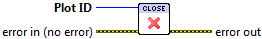

.. include:: /defs.txt

.. _vi_close:

Close Plot ID
=============

Close a plot identifier created with :ref:`vi_new`.  Any further use of the
identifier will result in an error.

To simplify your cleanup code, this VI ignores invalid **Plot ID** inputs.
Like other LabVIEW "close" VIs, this VI will run normally, and the plot will
be closed, even if errors are present on the "error in" terminal.

|int32_in| **Plot ID**
    Plot identifier to close.  An invalid or already-closed identifier will
    be ignored.

|error_in| |error_out| **Error In/Out**
    Errors will be propagated from **error in** to **error out**, but are
    otherwise ignored by this VI.
    
    
Errors
------

None.
