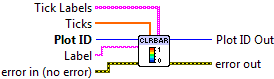

.. include:: /defs.txt

.. _vi_colorbar:

Add Colorbar
============

Add a colorbar, representing the last colormapped object plotted.

The colormap and range displayed are taken from the colormapped object.
For example, if you make a filled contour plot with :ref:`vi_contourfilled` and the
data range from -5 to +5, the colorbar will also range from -5 to +5.

The colorbar is displayed to the right of the axis box, with an optional
label.  Ticks and tick labels are chosen automatically, but may be
overridden if desired.

.. include:: /stdid.txt
    
|string_in| **Label**
    If non-empty, will be used as the axis label for the colorbar.
    
|double_1d_in| **Ticks**
    If non-empty, Colorbar axis ticks (in data units).  Default is to
    automatically pick appropriate tick locations.
    
|string_1d_in| **Tick Labels**
    If non-empty, labels for the colorbar axis ticks.  Only used if **Ticks**
    is also provided.
    
.. include:: /stderr.txt

.. only:: html

    Example
    -------

    Download :download:`Colormaps and Colorbars.vi </examples/Colormaps and Colorbars.vi>`,
    or see :ref:`guide_examples` for a complete list of examples.
    
.. include:: /stdpolar_ok.txt

Errors
------

* :ref:`error_invalid`
* :ref:`error_plotting`
* :ref:`error_init`

Other information
-----------------

If an entry in **Ticks** is non-finite (NaN or Inf), it will be ignored, along
with any matching entry in **Tick Labels**.  If all entries are non-finite,
the default automatic ticks will be used.  If the sizes of the two arrays
don't match, only the overlapping elements will be used.

If no colormap object is currently displayed, this VI does nothing (and no
error is returned).
