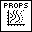
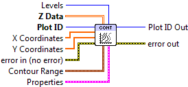
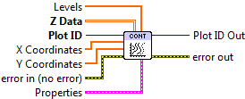

.. include:: /defs.txt

.. _vi_contour:

Contour Plot
============

Contour plots are made from 2D arrays, and consist of a series of lines
mapping out constant-value levels.  This VI only generates the lines
themselves; see :ref:`vi_contourfilled` for generating colored regions between
lines.

By default, contours are plotted with black lines.  Positive values are
plotted with solid lines, negative values with dashed lines.  Set
**Line.Style** to Solid to override this.

This is a polymorphic VI; you can choose between automatically generating
a specific number of contour levels (:ref:`vi_contour_automatic`) and
manually specifying the contour levels you want (:ref:`vi_contour_manual`).

The instance may be selected, or will change depending on the
data type wired to **Levels**; an integer specifying the number of levels
will select automatic contouring, while an array explicitly specifying the
levels will select manual contouring.

Data must be of shape 2x2 or larger to make a contour plot.

.. _vi_contour_automatic:

Contour Plot (Automatic)
------------------------

Make a contour plot, with N automatically chosen levels (**Levels** input),
defaulting to 10.  You can optionally set the min and max data values to
contour via the **Contour Range** terminal.

.. include:: /stdid.txt
        
|double_2d_in| **Z Data**
    2-D array for which to generate contours.  The first (slowest-varying)
    dimension is plotted along the Y axis; the second (fastest-varying)
    dimension is plotted along with X axis.

|double_1d_in| **X Coordinates**
    Optional 1-D array giving X axis coordinates.  Defaults to 0..NX-1, where
    NX is the size of **Z Data**'s second dimension.
    
|double_1d_in| **Y Coordinates**
    Optional 1-D array giving Y axis coordinates.  Defaults to 0..NY-1, where
    NY is the size of **Z Data**'s first dimension.
    
|int32_in| **Levels**
    Number of contours to automatically generate (default 10). 

|cluster_in| **Contour Range**
    Controls the limits within which contours will be plotted.
    
    |double_in| **Min Level**
        Only plot contour levels for data with this value or higher.
        
    |double_in| **Max Level**
        Only plot contour levels for data with this value or lower.
        
|contour_props| **Properties**
    Property cluster, available under the "Properties" subpalette.

    |bool_in| **Label Contours**
        If True, label the contours with their values.  Default is False.
        
    |cluster_in| **Line**
        Controls the appearance of the contour lines.
        
        .. include:: /stdline.txt
        
    |cluster_in| **Display**
        Controls the overall appearance of the contour plot.
        
        .. include:: /stddisplay.txt
        

.. include:: /stderr.txt

.. _vi_contour_manual:

Contour Plot (Manual)
---------------------

Make a contour plot, with contours explicitly specified via a 1D array
wired to the **Levels** terminal.

.. include:: /stdid.txt
        
|double_2d_in| **Z Data**
    2-D array for which to generate contours.  The first (slowest-varying)
    dimension is plotted along the Y axis; the second (fastest-varying)
    dimension is plotted along with X axis.

|double_1d_in| **X Coordinates**
    Optional 1-D array giving X axis coordinates.  Defaults to 0..NX-1, where
    NX is the size of **Z Data**'s second dimension.
    
|double_1d_in| **Y Coordinates**
    Optional 1-D array giving Y axis coordinates.  Defaults to 0..NY-1, where
    NY is the size of **Z Data**'s first dimension.
    
|double_1d_in| **Levels**
    Values at which to draw contours.
        
|contour_props| **Properties**
    Property cluster, available under the "Properties" subpalette.

    |bool_in| **Label Contours**
        If True, label the contours with their values.  Default is False.
        
    |cluster_in| **Line**
        Controls the appearance of the contour lines.
        
        .. include:: /stdline.txt
        
    |cluster_in| **Display**
        Controls the overall appearance of the contour plot.
        
        .. include:: /stddisplay.txt
        

.. include:: /stderr.txt

.. only:: html

    Example
    -------

    Download :download:`Contour Plot.vi </examples/Contour Plot.vi>`,
    or see :ref:`guide_examples` for a complete list of examples.
    
    .. image:: ContourExample.png

Axis Types
----------

Both :ref:`vi_contour_automatic` and :ref:`vi_contour_manual` may be used with
rectangular axes only.  Use with :ref:`polar <guide_polar>` axes will result
in :ref:`error_polar`.  Likewise, only linear scales are supported.  Use with
log or symlog axes will result in :ref:`error_scale`.

Errors
------

* :ref:`error_scale`
* :ref:`error_polar`
* :ref:`error_invalid`
* :ref:`error_plotting`
* :ref:`error_init`

Other information
-----------------

If an empty **Z Data** array is provided, or an array smaller than 2x2,
both VIs do nothing.

A zero value for **Levels** (Automatic) or an empty array (Manual) will result
in the whole plot being shaded a uniform color.  A negative value (Automatic)
will result in the default number of contours being displayed.  

The maximum number of levels is 500.  Requests for more than 500 levels will
be silently clipped to 500 (Automatic), or the first 500 levels in the array
(Manual).

If a non-finite value appears in **X Coordinates** or **Y Coordinates**, the
corresponding row or column of **Z Data** is not displayed.

If the size of **X Coordinates** or **Y Coordinates** does not match the size of the
corresponding axis for **Z Data**, only the overlap is displayed.  A zero-sized
array for either will result in the default coordinates being used (0..N-1).

A non-finite value for **Contour Range.Min Level** or **Contour Range.Max Level**
will result in the default value (min or max of **Z Data**) being used.

A non-finite value in **Z Data** will appear as a "hole" or artifact in the
contours.