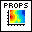
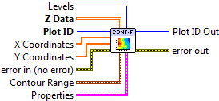
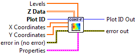

.. include:: /defs.txt

.. _vi_contourfilled:

Filled Contour Plot
===================

Make a filled contour plot.

Rather than having discrete contour lines, "filled" contour plots shade the
regions between contours according to a colormap.  Contour lines themselves
are not plotted. Use :ref:`vi_contour` in combination with this VI to display
lines.

The default colormap (**Colormap.Map**) is Rainbow.

This is a polymorphic VI; you can choose between automatically generating
a specific number of contour levels (:ref:`vi_contourfilled_automatic`) and
manually specifying the contour levels you want (:ref:`vi_contourfilled_manual`).

Data must be of shape 2x2 or larger to make a filled contour plot.

.. _vi_contourfilled_automatic:

Filled Contour Plot (Automatic)
-------------------------------

Make a filled contour plot, with N automatically chosen levels.  Note that
since you specify the number of *levels* (boundaries between regions),
the number of *shaded regions* displayed is N+1.

.. include:: /stdid.txt
        
|double_2d_in| **Z Data**
    2-D array for which to generate contours.  The first (slowest-varying)
    dimension is plotted along the Y axis; the second (fastest-varying)
    dimension is plotted along with X axis.

|double_1d_in| **X Coordinates**
    Optional 1-D array giving X axis coordinates.  Defaults to 0..NX-1, where
    NX is the size of **Z Data**'s second dimension.
    
|double_1d_in| **Y Coordinates**
    Optional 1-D array giving Y axis coordinates.  Defaults to 0..NY-1, where
    NY is the size of **Z Data**'s first dimension.
    
|int32_in| **Levels**
    Number of contours to automatically generate (default 10). 
    You can also set the min and max data value to contour via the
    **Contour Range** terminal.
        
|cluster_in| **Contour Range**
    Controls the limits within which contours will be plotted.
    
    |double_in| **Min Level**
        Only plot contour levels for data with this value or higher.
        
    |double_in| **Max Level**
        Only plot contour levels for data with this value or lower.

|contourfilled_props| **Properties**
    Property cluster, available under the "Properties" subpalette.

    |cluster_in| **Colormap**
        Controls the colormap used to display the regions.
        
        .. include:: /stdcmap.txt
        
    |cluster_in| **Display**
        Controls the overall appearance of the contour plot.
        
        .. include:: /stddisplay.txt
        
.. include:: /stderr.txt

.. _vi_contourfilled_manual:

Filled Contour Plot (Manual)
----------------------------

Make a filled contour plot, with explicitly specified levels.  Note that
since you specify the *levels* (boundaries between regions),
the number of *shaded regions* displayed is N+1.

.. include:: /stdid.txt
        
|double_2d_in| **Z Data**
    2-D array for which to generate contours.  The first (slowest-varying)
    dimension is plotted along the Y axis; the second (fastest-varying)
    dimension is plotted along with X axis.

|double_1d_in| **X Coordinates**
    Optional 1-D array giving X axis coordinates.  Defaults to 0..NX-1, where
    NX is the size of **Z Data**'s second dimension.
    
|double_1d_in| **Y Coordinates**
    Optional 1-D array giving Y axis coordinates.  Defaults to 0..NY-1, where
    NY is the size of **Z Data**'s first dimension.
    
|double_1d_in| **Levels**
    Values at which to draw region boundaries.
        
|contourfilled_props| **Properties**
    Property cluster, available under the "Properties" subpalette.

    |cluster_in| **Colormap**
        Controls the colormap used to display the regions.
        
        .. include:: /stdcmap.txt
        
    |cluster_in| **Display**
        Controls the overall appearance of the contour plot.
        
        .. include:: /stddisplay.txt
        
.. include:: /stderr.txt

.. only:: html

    Example
    -------

    Download :download:`Contour Plot (Filled).vi </examples/Contour Plot (Filled).vi>`,
    or see :ref:`guide_examples` for a complete list of examples.
    
    .. image:: ContourFilledExample.png

Axis Types
----------

Both :ref:`vi_contourfilled_automatic` and :ref:`vi_contourfilled_manual` may be used with
rectangular axes only.  Use with :ref:`polar <guide_polar>` axes will result
in :ref:`error_polar`.  Likewise, only linear scales are supported.  Use with
log or symlog axes will result in :ref:`error_scale`.

Errors
------

* :ref:`error_scale`
* :ref:`error_polar`
* :ref:`error_invalid`
* :ref:`error_plotting`
* :ref:`error_init`

Other information
-----------------

If an empty **Z Data** array is provided, or an array smaller than 2x2,
both VIs do nothing.

If **Levels** (Automatic) is 0, or (Manual) has no elements
elements, no plot will be made.  A negative value (Automatic)
will result in the default number of contour levels being displayed.
The maximum number of levels is 500.  Requests for more than
500 levels will be silently clipped to 500 (Automatic), or the first 500
elements of the levels array (Manual).

If a non-finite value appears in **X Coordinates** or **Y Coordinates**, the
corresponding row or column of **Z Data** is not displayed.

If the size of **X Coordinates** or **Y Coordinates** does not match the size of the
corresponding axis for **Z Data**, only the overlap is displayed.  A zero-sized
array for either will result in the default coordinates being used (0..N-1).

A non-finite value for **Contour Range.Min Level** or **Contour Range.Max Level**
will result in the default value (min or max of **Z Data**) being used.

A non-finite value in **Z Data** will appear as a "hole" or blank patch in the
shaded contours.
