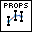
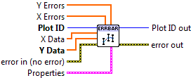

.. include:: /defs.txt

.. _vi_errorbar:

Add Errorbars
=============

Overlay error bars on the plot.

Call a plotting VI such as :ref:`vi_line`, :ref:`vi_scatter`, or
:ref:`vi_bar` first to display the data.  Then call this VI to add error bars.
Note this VI *only* adds error bars; it does not display lines or markers by
itself.

The only required input is **Y Data**, which specifies the point at the
center of the error bar.  The optional **X Data** defaults to an integer
series 0..N-1, where N is the number of elements in **Y Data**.

For **X Errors** and **Y Errors**, the values given specify the distance
from the data point to the end of the bar; in other words, if the value
V is given, the full width of the bar will be 2V.

By default, the color used for the bar will be the last color used to make a
bar, scatter, line, or histogram plot.  You can manually specify a color via
the **Color** setting.

.. include:: /stdid.txt
    
|double_1d_in| **X Data**
    Optional X locations of the data points.  Defaults to 0..N-1.
    
|double_1d_in| **Y Data**
    Y locations of the data points.

|double_1d_in| **X Errors**
    Magnitudes of the errors in the X direction.  The full width of the bar
    is twice the value provided.

|double_1d_in| **Y Errors**
    Magnitudes of the errors in the Y direction.  The full width of the bar
    is twice the value provided.
    
|errorbar_props| **Properties**
    Property cluster, available under the "Properties" subpalette.

    |uint32_in| **Color**
        Color of the error bars.  Default is the last color used for the plot.
        
    |double_in| **Line Width**
        Width of the error bar line, in points.
        
    |double_in| **Cap Size**
        Length of the error bar cap, in points.
        
    |cluster_in| **Display**
        Controls general appearance of the error bars.
        
        .. include:: /stddisplay.txt
        
.. include:: /stderr.txt

.. only:: html

    Example
    -------

    Download :download:`Error Bars.vi </examples/Error Bars.vi>`,
    or see :ref:`guide_examples` for a complete list of examples.
    
    .. image:: ErrorbarExample.png

.. include:: /stdpolar.txt

Errors
------

.. include:: /common_errors.txt

Other information
-----------------

If **Y Data** is empty, this VI does nothing.

If **X Data**, **Y Data**, **X Errors**, and **Y Errors** have different sizes,
only the overlap will be displayed.  If **X Data** is empty, the
default (0..N-1) values will be used.

If a non-finite entry (NaN or Inf) appears in **X Data** or **Y Data**,
neither bar will be displayed at that point.  If a non-finite entry occurs
in **X Errors** or **Y Errors**, the corresponding bar will not be displayed.

Negative values are permitted in **X Errors** and **Y Errors**; the absolute
magnitude is used to display the bar.

Non-finite or negative values for **Line Width** and **Cap Size** will be
ignored, and the defaults used.  Zero values are permitted.
