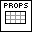
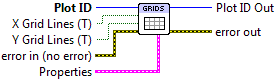

.. include:: /defs.txt

.. _vi_grids:

Grid Lines
==========

Controls display of axes box grid lines.

Grid lines originate at X and Y tick locations.  New rectangular plots have
grid lines turned off by default; they are on by default for polar plots.

.. include:: /stdid.txt

|bool_in| **X Grid Lines (T)**
    Display grid lines originating on X tick marks.  Default is True.
    
|bool_in| **Y Grid Lines (T)**
    Display grid lines originating on Y tick marks.  Default is True.
    
|grids_props| **Properties**
    Property cluster, available under the "Properties" subpalette.

    |cluster_in| **Line**
        Controls appearance of the grid lines.
        
        .. include:: /stdline.txt
    
.. include:: /stderr.txt

.. include:: /stdpolar_ok.txt

Errors
------

.. include:: /common_errors_polarok.txt
