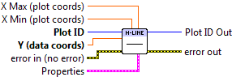

.. include:: /defs.txt
.. |hvline_props| image:: HVLineProps.png

.. _vi_hline:

Draw Horizontal Line
====================

Draw a horizontal line across the axis box, at a particular Y location.

The starting and ending locations of the line may optionally be specified, in
units of the axis width (0.0 to 1.0).

.. include:: /stdid.txt
    
|double_in| **Y (data coords)**
    Y location at which to draw the horizontal line, in data coordinates.
    
|double_in| **X Min (plot coords)**
    Start location of line, as a fraction of the plot width (0 to 1).  Default
    is to start at the left axis (0).

|double_in| **X Max (plot coords)**
    End location of line, as a fraction of the plot width (0 to 1).  Default
    is to end at the right axis (1).
    
|hvline_props| **Properties**
    Property cluster, available under the "Properties" subpalette.
    
    |cluster_in| **Line**
        Controls the appearance of the line.
        
        .. include:: /stdline.txt
    
    |cluster_in| **Display**
        Controls display appearance of the line.
        
        .. include:: /stddisplay.txt
        
.. include:: /stderr.txt

.. include:: /stdpolar.txt

Errors
------

.. include:: /common_errors.txt

Other information
-----------------

If **Y** is non-finite (NaN or Inf), the line will not be displayed, and no
error will be returned.

If **X Min** or **X Max** is non-finite or extends beyond the limits of the
axes, the default location will be used.  **X Max** may be smaller than
**X Min**; the line will be plotted normally.
