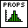
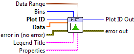
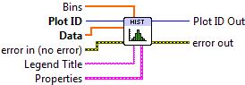

.. include:: /defs.txt

.. _vi_histogram:

Histogram Plot
==============

Make a 1D histogram plot from raw data.

A histogram plot is a bar chart showing the distribution of values in a
particular data set.  The X axis is divided into a number of regions, or
*bins*, and the data values are sorted into them.  The height of the bars
indicates the number of elements which fall in each bin.

Both Histogram VIs described here additionally support a *cumulative* mode,
in which the height of each bar indicates the number of values in that bin,
plus all previous bins.  Turn this on via the **Cumulative** setting in the
property cluster.

By default, the bar heights represent the raw number of values in each bin.
If the **Normalize** setting is True, the bar heights are percentages of the
total number of values in the input array.

This VI participates in :ref:`guide_color_cycle`.

This is a polymorphic VI, which provides two subVIs depending on how the bins
are specified.  To automatically generate a certain number of bins, use
:ref:`vi_histogram_automatic`.  To manually specify bins, use
:ref:`vi_histogram_manual`.  The polymorphic VI will also automatically adapt
based on the type of data wired to **Bins**.

.. _vi_histogram_automatic:

Histogram Plot (Automatic)
--------------------------

Make a histogram with a certain number of bins.  Provide your 1D data array
to **Data**, and the number of bins desired to the **Bins** input.
By default, the bins will span the full range of the data.  You can adjust
this "window" via the **Data Range** cluster.

.. include:: /stdid.txt
        
|double_1d_in| **Data**
    Raw data for which to produce the histogram.

|int32_in| **Bins**
    Number of bins to use when generating the histogram.  Default is 10.

|cluster_in| **Data Range**
    Controls the range of data displayed.
    
    |double_in| **Data Min**
        Values smaller than this will be dropped from the histogram.
        
    |double_in| **Data Max**
        Values larger than this will be dropped from the histogram.
        
|string_in| **Legend Title**
    Title to be displayed if a legend is added to the plot.

|histogram_props| **Properties**
    Property cluster, available under the "Properties" subpalette.

    |uint32_in| **Color**
        Color of the bars.  By default, uses the next value in the color cycle
        (shared with :ref:`vi_bar`).
        
    |bool_in| **Cumulative**
        If True, display a cumulative histogram, in which each bar represents
        the number of values in that bin plus all previous bins combined.
        
    |bool_in| **Normalize**
        If True, the heights of the bars represent the percentage (0 to 100)
        of values in each bin, rather than raw counts.
        
    |cluster_in| **Line**
        Controls the appearance of the lines surrounding the bins.
        
        .. include:: /stdline.txt
        
    |cluster_in| **Display**
        Controls the overall appearance of the plot.
        
        .. include:: /stddisplay.txt
        

.. include:: /stderr.txt

.. _vi_histogram_manual:

Histogram Plot (Manual)
-----------------------

Make a histogram with the bins explicitly specified.  This allows you to 
create irregularly-sized bins.

Provide your 1D data array
to **Data**, and the bin *edges* to **Bins**.  Note that since you are giving
the locations of the bin *edges*, if **Bins** has N elements, N-1 bars will be
displayed.

.. include:: /stdid.txt
        
|double_1d_in| **Data**
    Raw data for which to produce the histogram.

|double_1d_in| **Bins**
    Bin edges to use when computing the histogram.
        
|string_in| **Legend Title**
    Title to be displayed if a legend is added to the plot.
    
|histogram_props| **Properties**
    Property cluster, available under the "Properties" subpalette.

    |uint32_in| **Color**
        Color of the bars.  By default, uses the next value in the color cycle
        (shared with :ref:`vi_bar`).
        
    |bool_in| **Cumulative**
        If True, display a cumulative histogram, in which each bar represents
        the number of values in that bin plus all previous bins combined.
        
    |bool_in| **Normalize**
        If True, the heights of the bars represent the percentage (0 to 100)
        of values in each bin, rather than raw counts.
        
    |cluster_in| **Line**
        Controls the appearance of the lines surrounding the bins.
        
        .. include:: /stdline.txt
        
    |cluster_in| **Display**
        Controls the overall appearance of the plot.
        
        .. include:: /stddisplay.txt
        

.. include:: /stderr.txt

.. only:: html

    Example
    -------

    Download :download:`Histogram.vi </examples/Histogram.vi>`,
    or see :ref:`guide_examples` for a complete list of examples.
    
    .. image:: HistogramExample.png
    
Axis Types
----------

Both VIs support rectangular and :ref:`polar <guide_polar>` plots.

Errors
------

.. include:: /common_errors_polarok.txt

Other information
-----------------

If **Data** is empty, if **Bins** is set to 0 (Automatic), or has less than
two elements (Manual), no plot is displayed.  The color cycle is still advanced.

If **Bins** is negative (Automatic), the default number of bins will be used.

Non-finite elements in **Data** are ignored, and are not considered
when computing the normalized histogram.  Non-finite elements in **Bins**
(Manual) are ignored.  The ordering of elements in **Bins** (Manual) has no
significance.
