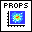
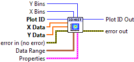
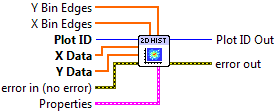

.. include:: /defs.txt

.. _vi_histogram2d:

2D Histogram Plot
=================

Make a 2D histogram plot from raw data.

This is the two-dimensional counterpart to :ref:`vi_histogram`.  Your raw
data, supplied via the **X Data** and **Y Data** inputs, consists of a
sequence of (X, Y) pairs.  The plane is divided into 2D patches or *bins*
into which your (X, Y) data is sorted.  

By default, the color of the patch indicates the number of values which fall
into that bin.  This is the quantity which shows up if you use
:ref:`vi_colorbar` to add a colorbar to the plot.  If the **Normalize**
setting is True, the color indicates the *percentage* of the total data
points which fall into the bin.

This is a polymorphic VI, which provides two subVIs depending on how the bins
are specified.  To automatically generate a certain number of bins in X and Y, use
:ref:`vi_histogram2d_automatic`.  To manually specify bins, use
:ref:`vi_histogram2d_manual`.  The polymorphic VI will also automatically adapt
based on the type of data wired to **X Bins** and **Y Bins**.

.. _vi_histogram2d_automatic:

2D Histogram Plot (Automatic)
-----------------------------

Make a histogram with a specific number of bins along each axis. 
In addition to your raw
data, provide integers to **X Bins** and **Y Bins** specifying the number
of bins desired along each axis.  You can limit the range of the data
displayed via the **Data Ranges** input; values outside these ranges will
not be displayed.

.. include:: /stdid.txt
        
|double_1d_in| **X Data**
    X coordinate for each data value.
    
|double_1d_in| **Y Data**
    Y coordinate for each data value.

|int32_in| **X Bins**
    Number of bins along the X axis.  Default is 10.

|int32_in| **Y Bins**
    Number of bins along the Y axis.  Default is 10.
    
|cluster_in| **Data Range**
    Controls the range of data displayed.
    
    |double_in| **X Min**
        Values whose X coordinate is smaller than this will be dropped.
        
    |double_in| **X Max**
        Values whose X coordinate is larger than this will be dropped.
        
    |double_in| **Y Min**
        Values whose Y coordinate is smaller than this will be dropped.
        
    |double_in| **Y Max**
        Values whose Y coordinate is larger than this will be dropped.
        
|histogram2d_props| **Properties**
    Property cluster, available under the "Properties" subpalette.

    |bool_in| **Normalize**
        If True, the value of each patch represents the *percentage* (0 to 100)
        of the values, rather than the raw number of counts.
        
    |cluster_in| **Colormap**
        Controls the colormap used to shade the patches.
        
        .. include:: /stdcmap.txt
        
    |cluster_in| **Display**
        Controls the overall appearance of the plot.
        
        .. include:: /stddisplay.txt
        
.. include:: /stderr.txt

.. _vi_histogram2d_manual:

2D Histogram Plot (Manual)
--------------------------

Make a 2D histogram with the bin boundaries explicitly specified. 
In addition to your raw data, provide 1D arrays to **X Bins** and
**Y Bins** which specify the bin *edges*.  Note that since you are
specifying the *edges* of the bins, if there are N elements in **X Bins**,
N-1 patches will be displayed along the X axis.

.. include:: /stdid.txt
        
|double_1d_in| **X Data**
    X coordinate for each data value.
    
|double_1d_in| **Y Data**
    Y coordinate for each data value.

|double_1d_in| **X Bins**
    Locations of the bin edges along the X axis.

|double_1d_in| **Y Bins**
    Locations of the bin edges along the Y axis.
        
|histogram2d_props| **Properties**
    Property cluster, available under the "Properties" subpalette.

    |bool_in| **Normalize**
        If True, the value of each patch represents the *percentage* (0 to 100)
        of the values, rather than the raw number of counts.
        
    |cluster_in| **Colormap**
        Controls the colormap used to shade the patches.
        
        .. include:: /stdcmap.txt
        
    |cluster_in| **Display**
        Controls the overall appearance of the plot.
        
        .. include:: /stddisplay.txt
        
.. include:: /stderr.txt

.. only:: html

    Example
    -------

    Download :download:`Histogram 2D.vi </examples/Histogram 2D.vi>`,
    or see :ref:`guide_examples` for a complete list of examples.
    
    .. image:: Histogram2DExample.png

Axis Types
----------

Both VIs may be used with rectangular axes only. 
Use with :ref:`polar <guide_polar>` axes will result
in :ref:`error_polar`.  Likewise, only linear scales are supported.  Use with
log or symlog axes will result in :ref:`error_scale`.

Errors
------

* :ref:`error_scale`
* :ref:`error_polar`
* :ref:`error_invalid`
* :ref:`error_plotting`
* :ref:`error_init`

Other information
-----------------

If **X Data** or **Y Data** is empty, if either **X Bins** or **Y Bins**
is set to 0 (Automatic), or has less than two elements (Manual),
no plot is displayed.

If **X Data** and **Y Data** are different sizes, only the overlap will
be displayed.

If **X Bins** or **Y Bins** is negative (Automatic), the default number of
bins will be used.

If non-finite elements occur in either **X Data** or **Y data**, that
particular (X, Y) pair is ignored, and will not be considered when computing
the normalized histogram.  Non-finite elements in **X Bins** and **Y Bins**
are ignored.  The ordering of elements in **X Bins** and **Y Bins** has no
significance.
