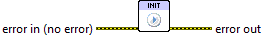

.. include:: /defs.txt

.. _vi_init:

Init
====

This optional VI allows you to manually start the plotting system.

The Toolkit uses plotting resources which have to be unpacked and set up
whenever plots are made.  Resources are cached between LabVIEW sessions in
order to minimize this startup time.  However, a few seconds of startup delay
is still typical for the first call during a LabVIEW session.  Subsequent calls
incur no overhead.

This VI does nothing but trigger initialization of the plotting system.  You
can use it to handle initialization outside of the main event loop of your
VI, in order to avoid "startup freeze".

This VI also allows you to handle the (rare) cases in which a problem
occurs during initialization.  Since this VI does nothing other than start
the plotting system, you can use it to trap the errors listed below and
take appropriate action, rather than explicitly handling them for each call
to a plotting VI.

.. include:: /stderr.txt
 
Errors
------

* :ref:`error_plotting`
* :ref:`error_init`
