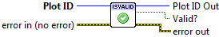

.. include:: /defs.txt

.. _vi_isvalid:

Is ID Valid
===========

Test a plot identifier to see if it's valid.  Invalid identifiers might come
from uninitialized controls, or from identifiers which have already been closed.

.. include:: /stdid.txt
    
|bool_out| **Valid?**
    Boolean indicating if the identifier is valid.

.. include:: /stderr.txt

Errors
------

* :ref:`error_init`
* :ref:`error_plotting`
