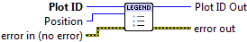

.. include:: /defs.txt

.. _vi_legend:

Add Legend
==========

Add a descriptive legend to the plot.

Legend entries are automatically generated, one per previous call to
:ref:`vi_line`, :ref:`vi_scatter`, or :ref:`vi_bar`.  Provide the name you
would like to see on the legend via the "Legend Title" terminal to each of
these VIs.  

If you wish to omit an object from the legend, simply leave the "Legend Title"
terminal disconnected, or supply an empty string.

.. include:: /stdid.txt
    
|enum_in| **Position**
    Location of the legend on the plot.  By default, an appropriate location
    is chosen automatically.
    
.. include:: /stderr.txt

.. only:: html

    Example
    -------

    Download :download:`Legend.vi </examples/Legend.vi>`,
    or see :ref:`guide_examples` for a complete list of examples.
    
    .. image:: LegendExample.png

.. include:: /stdpolar_ok.txt

Errors
------

.. include:: /common_errors_polarok.txt
