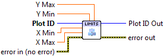

.. include:: /defs.txt

.. _vi_limits:

Set Axis Limits
===============

Set explicit data limits for the X and Y axes.  All inputs are optional.

.. include:: /stdid.txt

|double_in| **X Min**
    Lower limit for X axis.
    
|double_in| **X Max**
    Upper limit for X axis.
    
|double_in| **Y Min**
    Lower limit for Y axis.
    
|double_in| **Y Max**
    Upper limit for Y axis.

.. include:: /stderr.txt

Axis Types
----------

This VI supports both rectangular and :ref:`polar <guide_polar>` axes.  However,
for polar axes, only the Y (radial) limits may be specified.  Providing values
for X (angular) limits will result in error :ref:`error_polar`.

Errors
------

.. include:: /common_errors.txt

Other information
-----------------

Non-finite values for limits (NaN or Inf) will be ignored.  On a log-scaled
plot, zero or negative limit values will also be ignored.
