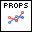

.. include:: /defs.txt

.. _vi_line:

Line Plot
=========

Make a line plot.

A line plot consists of a number of data points joined by a line.  By default,
only the line is shown; markers for the individual points are not.

**Y Data** is the only required input, and is a 1D array with the Y locations
of the data points.  If the optional **X Data** is not provided, an integer
series 0..N-1 will be used, where N is the number of elements in **Y Data**.

Markers may be shown by setting **Marker.Style** to something other than
Automatic, such as Square, Circle, etc.  By default, the line and markers
have the same color, determined by :ref:`guide_color_cycle`.

.. image:: Line.png

.. include:: /stdid.txt
    
|double_1d_in| **X Data**
    Optional X locations of the data points.  Defaults to 0..N-1.
    
|double_1d_in| **Y Data**
    Y locations of the data points.

|string_in| **Legend Title**
    Title to be displayed if a legend is added to the plot.

|line_props| **Properties**
    Property cluster, available under the "Properties" subpalette.

    |cluster_in| **Line**
        Controls the appearance of the line.
        
        .. include:: /stdline.txt
            
    |cluster_in| **Marker**
        Controls the appearance of the data markers.  By default, they are
        not shown; specify **Marker.Style** to change this.
           
        .. include:: /stdmarker.txt
        
    |cluster_in| **Display**
        Controls general appearance of the line plot.
        
        .. include:: /stddisplay.txt
        
.. include:: /stderr.txt

.. only:: html

    Example
    -------

    Download :download:`Line Plot.vi </examples/Line Plot.vi>`,
    or see :ref:`guide_examples` for a complete list of examples.
    
    .. image:: LineExample.png

.. include:: /stdpolar_ok.txt

Errors
------

.. include:: /common_errors_polarok.txt

Other information
-----------------

If **Y Data** is empty, no plot is made but the color cycle is advanced.

If a non-finite entry (NaN or Inf) appears in **X Data** or **Y Data**,
the corresponding point will not be displayed.

If **X Data** and **Y Data** are different sizes,  only the overlap will be
displayed.  If **X Data** is empty, the default (0..N-1) values will be used.
