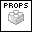
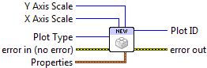

.. include:: /defs.txt

.. _vi_new:

New Plot ID
===========

Create a new plot.  You can choose between rectangular axes (default) or polar
axes.  See :ref:`guide_polar` for more information on using polar plots.

Outputs a new PlotID, which can be passed to plotting or rendering VIs.  You
must eventually close this identifier with :ref:`vi_close` or resource leaks
will result.

|enum_in| **Plot Type**
    Choose between rectangular (default) and polar axes.
    
|enum_in| **X Axis Scale**
    Set scale type for the X axis (linear, log, or symlog; see below).  
    For polar plots, only linear scales are supported.  Requesting a log or 
    symlog scale will result in :ref:`error_scale`.
    
|enum_in| **Y Axis Scale**
    Set scale type for the Y axis (linear, log, or symlog; see below).
    
|new_props| **Properties**    
    Property cluster, available under the "Properties" subpalette.
    
    |uint32_in| **Background Color**
        PlotColor or LabVIEW color setting the plot background (everything
        outside the axis bounds).
        
    |uint32_in| **Axis Background**
        PlotColor or LabVIEW color setting the background color within the axis
        bounds.
        
    |double_in| **Left Margin**
        Space between the left axis and the edge of the plot, expressed as a
        fraction of the plot width.  Example: 0.25.
        
    |double_in| **Right Margin**
        Space between the right axis and the edge of the plot, expressed as a
        fraction of the plot width.  Example: 0.25.
        
    |double_in| **Bottom Margin**
        Space between the bottom axis and the edge of the plot, expressed as a
        fraction of the plot height.  Example: 0.1.
        
    |double_in| **Top Margin**
        Space between the top axis and the edge of the plot, expressed as a
        fraction of the plot height.  Example: 0.1.
        
    |double_in| **Aspect Ratio**
        Set the pixels-per-data-unit ratio between the X and Y axes.  By
        default, the aspect ratio is "floating" and changes automatically
        when the plot is resized.  Polar plots always have 1.0 aspect ratio.
        
|int32_out| **Plot ID**
    New plot identifier.  You must eventually close this with a call to
    :ref:`vi_close`, or resource leaks will occur.
    
.. include:: /stderr.txt

.. only:: html

    Example
    -------

    Download :download:`Getting Started.vi </examples/Getting Started.vi>`,
    or see :ref:`guide_examples` for a complete list of examples.
    
Errors
------

* :ref:`error_init`
* :ref:`error_plotting`
* :ref:`error_scale`

About scales
------------

*Linear* scales are the default, and can display positive or negative values.

Logarithmic or *log* scales are used to display data which range over many
orders of magnitude, but can only display positive data. The log base is 10.

Symmetric log, or *symlog* scales are a hybrid.  They can display positive or
negative data; a linear plot is used for a region around the origin.  The log
base is 10.

Other information
-----------------

Margin values may be negative or greater than one, in which case the axis will
extend off the side of the plot.  If non-finite, the default values will be
used.

If **Aspect Ratio** is zero, negative, or non-finite, the default ratio will
be used.
