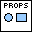
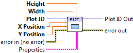

.. include:: /defs.txt

.. _vi_rectangle:

Draw Rectangle
==============

Draw a rectangle, in data coordinates.

Places a rectangle on the plot, by specifying the X and Y location of the
lower-left corner, along with width and height.  This VI may also be used
with polar plots, in which case the "rectangle" is a wedge.

.. include:: /stdid.txt
    
|double_in| **X Position**
    X position of the lower-left corner of the rectangle.
    
|double_in| **Y Data**
    Y position of the lower-left corner of the rectangle.

|double_in| **Width**
    Rectangle width.
    
|double_in| **Height**
    Rectangle height.
    
|rectangle_props| **Properties**
    Property cluster, available under the "Properties" subpalette.

    |uint32_in| **Color**
        Fill color for the rectangle.  Defaults to light-grey.
    
    |cluster_in| **Line**
        Controls the appearance of the rectangle edge.
        
        .. include:: /stdline.txt
        
    |cluster_in| **Display**
        Controls general appearance of the rectangle.
        
        .. include:: /stddisplay.txt
        
.. include:: /stderr.txt

.. only:: html

    Example
    -------

    Download :download:`Shapes.vi </examples/Shapes.vi>`,
    or see :ref:`guide_examples` for a complete list of examples.
    
    .. image:: ShapesExample.png

Axis Types
----------

This VI supports both polar and rectanguar axes, as well as linear and log
scales.  However, use with symlog scales is not currently supported, and will
result in error :ref:`error_scale`.

Errors
------

* :ref:`error_scale`
* :ref:`error_invalid`
* :ref:`error_plotting`
* :ref:`error_init`

Other information
-----------------

If **X Position** or **Y Position** is non-finite, no rectangle is drawn.
If **Width** or **Height** is non-finite or zero, no rectangle is drawn.
Negative heights and widths are permitted.
