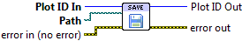

.. include:: /defs.txt

.. _vi_save:

Save Plot To Disk
=================

Save the plot to a file.

The Advanced Plotting Toolkit supports vector output in PDF format,
as well as common raster image formats like PNG, TIFF and JPEG.

Wire a file path to the **Path** terminal; any existing file will be
overwritten.  The output format is determined using the file extension
(case-insensitive).

.. include:: /stdid.txt

|path_in| **Path**
    The plot will be saved to this file. Any existing file will be
    overwritten.  An error occurs if the destination is not writable, or
    is a directory.
    
.. include:: /stderr.txt

.. only:: html

    Example
    -------

    Download :download:`Saving to Disk.vi </examples/Saving to Disk.vi>`,
    or see :ref:`guide_examples` for a complete list of examples.
    

.. _vi_save_formats:

Supported formats
-----------------

======= =================================== =========== =======
Format  Description                         Extension   Kind
======= =================================== =========== =======
PDF     Portable Document Format            .pdf        Vector
PNG     Portable Network Graphics           .png        Bitmap
BMP     Windows Bitmap                      .bmp        Bitmap
TIFF    Tagged Image File Format            .tiff, .tif Bitmap
JPEG    Joint Photographic Experts Group    .jpeg, .jpg Bitmap
GIF     Graphics Interchange Format         .gif        Bitmap
======= =================================== =========== =======

Errors
------

* :ref:`error_file_save`.  An error occured when saving; for example, invalid permissions or a missing directory.
* :ref:`error_file_extension`
* :ref:`error_invalid`
* :ref:`error_plotting`
* :ref:`error_init`
