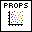
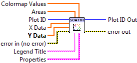

.. include:: /defs.txt

.. _vi_scatter:

Scatter Plot
============

Make a scatter plot.

A scatter plot consists of a number of discrete data points represented by
markers and not connected by lines.  The only required input is **Y Data**;
if **X Data** is not provided, integer values 0..N-1 will be used where N
is the number of elements in **Y Data**.

By default, all markers have the same area, given by **Marker.Size**.  To
provide a specific area for each marker, supply a 1D array to **Areas**.
The units for both **Areas** and **Marker.Size** are square points.

By default, all markers have the same color, taken from :ref:`guide_color_cycle`.
To use a colormap instead, supply a 1D array to the **Colormap Values**
input and make sure **Marker.Color** is set to Automatic.

.. include:: /stdid.txt
    
|double_1d_in| **X Data**
    Optional X locations of the data points.  Defaults to 0..N-1.
    
|double_1d_in| **Y Data**
    Y locations of the data points.

|double_1d_in| **Areas**
    Optional marker areas for each data element, in units of square points.
    
|double_1d_in| **Colormap Values**
    Optional values to use when coloring the markers according to a colormap.

|string_in| **Legend Title**
    Title to be displayed if a legend is added to the plot.

|scatter_props| **Properties**
    Property cluster, available under the "Properties" subpalette.
        
    |cluster_in| **Marker**
        Controls the appearance of the data markers.
           
        .. include:: /stdmarker.txt
        
    |cluster_in| **Line**
        Controls the appearance of the data marker edge lines.
        
        .. include:: /stdline.txt
        
    |cluster_in| **Colormap**
        When a **Colormap Value** input is present, determines the colormap
        used to shade the markers.
        
        .. include:: /stdcmap.txt
        
    |cluster_in| **Display**
        Controls general appearance of the scatter plot.
        
        .. include:: /stddisplay.txt
        
.. include:: /stderr.txt

.. only:: html

    Example
    -------

    Download :download:`Scatter.vi </examples/Scatter.vi>`,
    or see :ref:`guide_examples` for a complete list of examples.
    
    .. image:: ScatterExample.png
    
.. include:: /stdpolar_ok.txt

Errors
------

.. include:: /common_errors_polarok.txt

Other information
-----------------

If **Y Data** is empty, this VI does nothing.

If an non-finite entry (NaN or Inf) appears in **X Data**, **Y Data**,
**Areas**, or **Colormap Values**, the corresponding marker will not
be displayed.  If an entry in **Areas** is zero or negative, the corresponding
marker will not be displayed.

If any of the inputs have mismatched sizes, only the overlapping portions will
be displayed.  If empty arrays are provided for **X Data**, **Areas** or
**Colormap Values**, they will be ignored and the defaults used.

Zero values are permitted for **Marker.Size** and **Line.Width**.  Negative
values will be ignored, and the defaults used.
