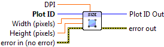

.. include:: /defs.txt

.. _vi_size:

Set Plot Size
=============

Set the width and height of the plot.

Because LabVIEW and most output formats are pixel-oriented, you specify the
size of the plot in pixels.  Plots are stored internally using vector graphics,
and can be arbitrarily resized without any loss of detail.

Each plot also has an assocated *dots per inch* or DPI.  When writing to a
vector output format like PDF (which has native units of inches), this value
determines the size of the plot.

New plots have size 640x480, and a DPI of 80.
    

.. include:: /stdid.txt

|double_in| **Width (pixels)**
    New plot width. Default is to leave the width unchanged.
    
|double_in| **Height (pixels)**
    New plot height. Default is to leave the height unchanged.
    
|double_in| **DPI**
    Dots-per-inch factor used when going from inches to pixels.  Default is to
    leave the DPI unchanged.
    
.. include:: /stderr.txt

.. only:: html

    Example
    -------

    Download :download:`Resizing.vi </examples/Resizing.vi>`,
    or see :ref:`guide_examples` for a complete list of examples.
    
.. include:: /stdpolar_ok.txt

Errors
------

.. include:: /common_errors_polarok.txt

Other information
-----------------

For **Width** and **Height**: non-finite (NaN or Inf) values, and values of 
1 or smaller, are ignored and the defaults used.  For **DPI**, values less than
10 will be ignored, and the defaults used.
