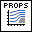
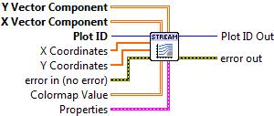

.. include:: /defs.txt

.. _vi_streamline:

Streamline Plot
===============

Display a vector field using streamlines.

Provide two 2D arrays, giving the **X Vector Component** and
**Y Vector Component** at each point on the grid.  Streamlines are
automatically generated; adjust the **Density** setting to control how
many are used.

By default, streamlines are plotted in black.  If a 2D array is supplied to the
**Colormap Value** input, its contents will be used to shade the streamlines
according to a colormap.  A solid color may also be specified via
**Line.Color**.  At present, line styles other than Automatic or Solid are
ignored.

.. note::
    Due to technical limitations, array dimensions of 2 and 4 are currently
    forbidden and will result in a blank plot; for example, a 2x9 or 7x4
    shape array.

.. include:: /stdid.txt
    
|double_1d_in| **X Coordinates**
    Optional 1-D array giving X axis coordinates.  Defaults to 0..NX-1, where
    NX is the size of the data's second dimension.  If provided, points must
    be monotonic and uniformly spaced, or :ref:`error_coordinates` will result.
    
|double_1d_in| **Y Coordinates**
    Optional 1-D array giving Y axis coordinates.  Defaults to 0..NY-1, where
    NY is the size of the data's first dimension.  If provided, points must
    be monotonic and uniformly spaced, or :ref:`error_coordinates` will result.
    
|double_2d_in| **X Vector Component**
    X vector component at each point.

|double_2d_in| **Y Vector Component**
    Y vector component at each point.

|double_2d_in| **Colormap Value**
    Optional 2D array which will be used to color the streamlines, according
    to a colormap.
    
|streamline_props| **Properties**
    Property cluster, available under the "Properties" subpalette.
        
    |double_in| **Density**
        Scale factor controlling density of streamlines.  Default is 1.
        
    |double_in| **Arrow Size**
        Scale factor controlling size of arrows on the streamlines.
        Default is 1.
           
    |cluster_in| **Line**
        Controls the appearance of the streamlines.  At the moment, only
        "Automatic" and "Solid" line styles are supported; others will
        be ignored.
        
        .. include:: /stdline.txt
        
    |cluster_in| **Colormap**
        Controls the colormap used to shade the arrows, when a
        **Colormap Value** array is given.
        
        .. include:: /stdcmap.txt
        
        
.. include:: /stderr.txt

.. only:: html

    Example
    -------

    Download :download:`Streamlines.vi </examples/Streamlines.vi>`,
    or see :ref:`guide_examples` for a complete list of examples.
    
    .. image:: StreamlineExample.png

Axis Types
----------

This VI supports rectangular axes.  Use with :ref:`polar axes <guide_polar>`
will result in :ref:`error_polar`.  Likewise, only linear scales are supported.
Use with log or symlog axes will result in :ref:`error_scale`.

Errors
------

* :ref:`error_coordinates`
* :ref:`error_scale`
* :ref:`error_polar`
* :ref:`error_invalid`
* :ref:`error_plotting`
* :ref:`error_init`

Other information
-----------------

If an empty array is provided for **X Vector Component** or **Y Vector Component**,
this VI does nothing.

If a non-finite value appears in **X Coordinates** or **Y Coordinates**,
:ref:`error_coordinates` will result.  A non-finite value in **X Vector Component** or
**Y Vector Component** has undefined results.

If the sizes of any of the inputs are not the same, only the overlapping
region will be displayed.  If a zero-size array is provided for any of
**X Coordinates**, **Y Coordinates**, or **Colormap Value**, it will be ignored.

A non-finite or negative value for **Density** or **Arrow Size** will
be ignored.

Values for **Line.Style** other than Automatic or Solid are currently ignored.
