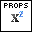
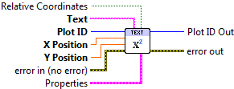

.. include:: /defs.txt

.. _vi_text:

Add Text
========

Add text to the plot.

Provide a string, and X/Y positions.  By default, the positions are in data
units.  This can be changed to width/height relative units (0.0 to 1.0) by
setting the **Relative Coordinates** input to True.

.. include:: /stdid.txt

|string_in| **Text**
    Text to display.  May contain inline markup; see :ref:`guide_latex`.
    
|double_in| **X Position**
    X location for the lower left corner of the displayed text.
    
|double_in| **Y Position**
    Y location for the lower left corner of the displayed text.
    
|bool_in| **Relative Coordinates**
    By default, **X Position** and **Y Position** are in data units.  If
    True, use axis-relative (0.0 to 1.0) units instead.
    
|text_props| **Properties**
    Property cluster, available under the "Properties" subpalette.
    
    |cluster_in| **Text**
        Controls text layout and options.

        .. include:: /stdtext.txt
    
    |cluster_in| **Display**
        Controls text display appearance.
        
        .. include:: /stddisplay.txt
        
.. include:: /stderr.txt

.. only:: html

    Example
    -------

    Download :download:`Text Markup.vi </examples/Text Markup.vi>`,
    or see :ref:`guide_examples` for a complete list of examples.
    
    .. image:: TextExample.png

.. include:: /stdpolar_ok.txt

Errors
------

.. include:: /common_errors_polarok.txt

Other information
-----------------

If **X Position** or **Y Position** is non-finite (NaN or Inf), the text will
not be displayed and no error will be returned.

If values are used which place the text partially or completely out of the axis
box, only the portion which remains within the axis box will be displayed.

A font size of 0 will be ignored, and the default used.  Negative font sizes
have undefined effects.