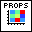
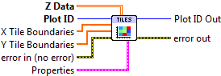

.. include:: /defs.txt

.. _vi_tiles:

Tile Plot
=========

Display a 2D array as a series of colored tiles.

Supply a 2D array of data; it will be displayed as a series of rectangles
(tiles) colored according to a colormap.  The tile boundaries along X and Y
may optionally be specified.  This VI differs from :ref:`vi_arrayview` in
that the tiles appear as discrete units, with no smoothing applied.  It is the
same approach as used with :ref:`vi_histogram2d`.

By default, no lines are shown between tiles.  This may be adjusted via
the *Line* entry in the property cluster.

.. include:: /stdid.txt
    
|double_2d_in| **Z Data**
    2D data to display.
    
|double_1d_in| **X Tile Boundaries**
    Optional locations of the tile edge locations.  Note that if **Z Data**
    has NX elements in the X direction, this array should have NX+1 elements.
    Defaults to 0..NX.
    
|double_1d_in| **Y Tile Boundaries**
    Optional locations of the tile edge locations.  Note that if **Z Data**
    has NY elements in the Y direction, this array should have NY+1 elements.
    Defaults to 0..NY.
    
|tiles_props| **Properties**
    Property cluster, available under the "Properties" subpalette.
        
    |cluster_in| **Colormap**
        Controls the colormap used to color the tiles.
        
        .. include:: /stdcmap.txt
        
    |cluster_in| **Line**
        Controls the appearance of the lines between tiles.  Note: only
        "Automatic" and "Solid" styles are currently supported; other styles
        will be ignored.
        
        .. include:: /stdline.txt
        
    |cluster_in| **Display**
        Controls general appearance of the tile plot.
        
        .. include:: /stddisplay.txt
        
.. include:: /stderr.txt

.. only:: html

    Example
    -------

    Download :download:`Tile Plot.vi </examples/Tile Plot.vi>`,
    or see :ref:`guide_examples` for a complete list of examples.
    
    .. image:: TilesExample.png
    
.. include:: /stdpolar.txt

Errors
------

.. include:: /common_errors.txt

Other information
-----------------

If **Z Data** is empty, no plot is made.

If either **X Tile Boundaries** or **Y Tile Boundaries** has less than two
entries, or contains non-finite entries (NaN or Inf), it will be ignored and
the defaults (0..NX and 0..NY) will be used.

