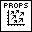
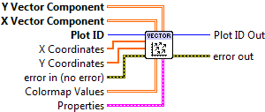

.. include:: /defs.txt

.. _vi_vectorfield:

Vector Field Plot
=================

Display a field of vector arrows.

Provide two 2D arrays, giving the **X Vector Component** and
**Y Vector Component** at each point on the grid.  Arrows are drawn starting
at each grid location; their length is proportional to the vector magnitude.

The overall size of all vectors can be changed via the **Arrow Scale**
setting.  In keeping with industry practice, this value is in
*data units per pixel*.  In other words, if **Arrow Scale** were set to 10,
a vector with magnitude 50 in data units would be 5 pixels long.

Vectors are colored black by default.  To use a colormap, supply a 2D array
to **Colormap Values**.  Its values will be used to color the arrows,
according to the selected colormap.  A solid color may be selected via
**Color** in the property cluster.

.. include:: /stdid.txt

|double_1d_in| **X Coordinates**
    Optional 1-D array giving X axis coordinates.  Defaults to 0..NX-1, where
    NX is the size of the data's second dimension.
    
|double_1d_in| **Y Coordinates**
    Optional 1-D array giving Y axis coordinates.  Defaults to 0..NY-1, where
    NY is the size of the data's first dimension.
    
|double_2d_in| **X Vector Component**
    X component at each point.

|double_2d_in| **Y Vector Component**
    Y component at each point.
    
|double_2d_in| **Colormap Values**
    Optional 2D array which will be used to color the arrows.
    
|vectorfield_props| **Properties**
    Property cluster, available under the "Properties" subpalette.
        
    |uint32_in| **Color**
        Arrow color.  May be a PlotColor or LabVIEW color.
        
    |double_in| **Arrow Scale**
        Arrow scale factor, in *data units per pixel*.  For example, a value
        of 10 would mean that a magnitude-50 vector was 5 pixels long.
        Default is to pick an appropriate scale factor automatically.
        
    |cluster_in| **Colormap**
        Controls the colormap used to shade the arrows, when **Arrow Color**
        is set to Automatic.
        
        .. include:: /stdcmap.txt
        
    |cluster_in| **Display**
        Controls general appearance of the plot.
        
        .. include:: /stddisplay.txt
        
.. include:: /stderr.txt

.. only:: html

    Example
    -------

    Download :download:`Vector Field.vi </examples/Vector Field.vi>`,
    or see :ref:`guide_examples` for a complete list of examples.
    
    .. image:: VectorFieldExample.png
    
Axis Types
----------

This VI supports rectangular axes.  Use with :ref:`polar axes <guide_polar>`
will result in :ref:`error_polar`.  Likewise, only linear scales are supported.
Use with log or symlog axes will result in :ref:`error_scale`.

Errors
------

* :ref:`error_scale`
* :ref:`error_polar`
* :ref:`error_invalid`
* :ref:`error_plotting`
* :ref:`error_init`

Other information
-----------------

If an empty array is provided for **X Vector Component** or **Y Vector Component**,
this VI does nothing.

If a non-finite value appears in **X Coordinates** or **Y Coordinates**, the
corresponding row or column is not displayed.  A non-finite value in
**X Vector Component** or **Y Vector Component** will result in the corresponding
arrow not being displayed.

If the sizes of any of the inputs are not the same, only the overlapping
region will be displayed.  If a zero-size array is provided for any of
**X Coordinates**, **Y Coordinates**, or **Colormap Value**, it will be ignored.

A non-finite, zero, or negative value for **Arrow Scale** will be ignored.
