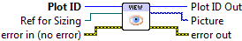

.. include:: /defs.txt

.. _vi_view:

View Plot As Picture
====================

Render the plot to a LabVIEW picture, so it can be displayed.

By default, the plot will be rendered using whatever size it currently has
(see :ref:`vi_size`).  To exactly match the dimensions of an existing Picture
control, wire a control reference to the **Ref for Sizing** terminal.

.. note::

    To save your plot to a file on disk, use :ref:`vi_save`.
    

.. include:: /stdid.txt
    
|ref_in| **Ref for Sizing**
    Optional reference to an existing Picture object.  If provided, the plot
    will first be resized to exactly match the dimensions of the Picture.
    See also :ref:`vi_size`.
    
|picture_out| **Picture**
    Rendered plot, as a LabVIEW Picture.

.. include:: /stderr.txt

.. only:: html

    Example
    -------

    Download :download:`Getting Started.vi </examples/Getting Started.vi>`,
    or see :ref:`guide_examples` for a complete list of examples.

Errors
------

* :ref:`error_invalid`
* :ref:`error_plotting`
* :ref:`error_init`

Other information
-----------------

Invalid Picture references wired to **Ref for Sizing** will be ignored.
