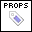
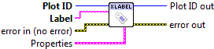

.. include:: /defs.txt

.. _vi_xlabel:

Set X Label
===========

Set the label for the X axis.

.. include:: /stdid.txt

|string_in| **Label**
    Text to display.  May contain inline markup; see :ref:`guide_latex`.
    
|label_props| **Properties**
    Property cluster, available under the "Properties" subpalette.
    
    |cluster_in| **Text**
        Controls text layout and options.

        .. include:: /stdtext.txt
        
.. include:: /stderr.txt

.. include:: /stdpolar_ok.txt

Errors
------

.. include:: /common_errors_polarok.txt
