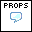
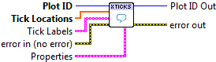

.. include:: /defs.txt

.. _vi_xticks:

Set X Ticks
===========

Set the X axis tick locations, and optionally labels, for linear axis scales.

.. include:: /stdid.txt
    
|double_1d_in| **Tick Locations**
    Locations of X-axis ticks (in data units).
    
|string_1d_in| **Tick Labels**
    Labels for the ticks.  By default, appropriate labels are chosen based
    on the type of data plotted and its range.
    
|tick_props| **Properties**
    Property cluster, available under the "Properties" subpalette.
    
    |cluster_in| **Text**
        Controls display of the tick labels.

        .. include:: /stdtext.txt
        
.. include:: /stderr.txt

.. include:: /stdpolar_ok.txt

Errors
------

* :ref:`error_scale`
* :ref:`error_invalid`
* :ref:`error_plotting`
* :ref:`error_init`

Other information
-----------------

If tick values are given which are offscreen, the plot will be expanded to
display them.  See :ref:`vi_limits` to set the X and Y axis ranges explicitly.

Non-finite (NaN or Inf) entries in **Tick Locations** are ignored, as are
corresponding entries in **Tick Labels**.

If the axis scale is log or symlog, error :ref:`error_scale` will result.
